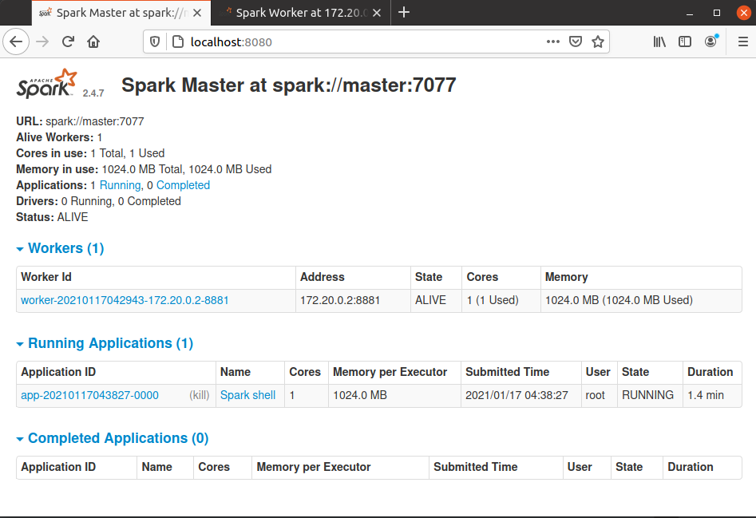

<h1 align="center">
  <h4 align="center">Docker Spark Stand-Alone</h4>
</h1>

<p align="center">
       <a href="">
           
         </a>
    </p>

## Summary

Spark 2.4.7 stand alone docker image

This is a docker image of [Apache Spark](https://spark.apache.org/)

## Requirements

|Package|Version|  
|:-----:|:-----:|  
|python3|3.8.5|  
|docker|20.10.2|
|docker-compose|1.27.4|
|spark|2.4.7|

## How to run

This image can be used to run using the [docker-compose file](docker-compose.yml)

1. Install docker-compose.
2. Run `docker-compose up`.

```sh
~/projects/personal/docker-spark-stand-alone$ sudo docker-compose up
Creating spark-worker-1 ... done
Creating spark-master   ... done
Attaching to spark-worker-1, spark-master
spark-worker-1    | 2021-01-17 04:29:42,210 INFO worker.Worker: Started daemon with process name: 1@35ef8be86a36
spark-master      | 2021-01-17 04:29:42,210 INFO master.Master: Started daemon with process name: 1@master
```

Access the UIs:
1. Spark Master at spark://master:7077 (http://localhost:8080/).
2. Spark Worker at 172.20.0.2:8881 (http://localhost:8081/).

Exec into a container, to run `SparkScala`.
```sh
~/projects/personal/docker-spark-stand-alone$ sudo docker exec -it spark-master /bin/bash
[sudo] password for renien: 
root@master:/usr/spark-2.4.7# spark-shell 
2021-01-17 04:38:20,713 WARN util.NativeCodeLoader: Unable to load native-hadoop library for your platform... using builtin-java classes where applicable
Setting default log level to "WARN".
To adjust logging level use sc.setLogLevel(newLevel). For SparkR, use setLogLevel(newLevel).
Spark context Web UI available at http://localhost:4040
Spark context available as 'sc' (master = spark://master:7077, app id = app-20210117043827-0000).
Spark session available as 'spark'.
Welcome to
      ____              __
     / __/__  ___ _____/ /__
    _\ \/ _ \/ _ `/ __/  '_/
   /___/ .__/\_,_/_/ /_/\_\   version 2.4.7
      /_/
         
Using Scala version 2.11.12 (Java HotSpot(TM) 64-Bit Server VM, Java 1.8.0_271)
Type in expressions to have them evaluated.
Type :help for more information.

scala>
```

SparkUI:



## License
[Docker Spark Standalone](https://github.com/Renien/docker-spark-stand-alone) is released under the [MIT](https://opensource.org/licenses/MIT) © [Renien](https://github.com/Renien).
